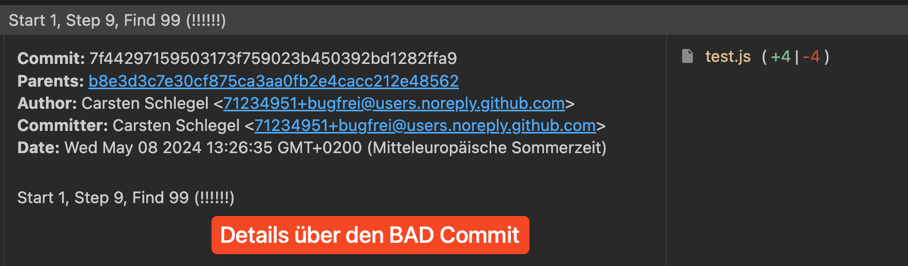

# Git bisect

Zum suchen nach dem ersten Commit, der einen Fehler enthält.

Zum testen ob ein Commit funktioniert `node test.js` ausführen. Ist die Ausgabe

`Test erfolgreich` funktioniert es, ist es `Test FEHLGESCHLAGEN!` so funktioniert es nicht.

## Ablauf

Wir haben 8 Commits die funktionieren (7f44297, b8e3d3c, e66fd8d, 61a6390, 3ea3cb1, 2a44e33, 6354fa7, ecee44d).
Und 10 Commits die nicht funktionieren (d043d55, 226c07d, b2c4ac0, c330bc4, 68043c9, 763e344, fa5cdf9, 44d3016, 2fe698f, 7f44297).
Wobei `7f44297` der Commit ist, bei dem sich der "Fehler" eingeschlichen hat. Diesen wollen wir finden.

### Einen GOOD und einen BAD Commit finden

Angenommen wir haben jetzt erst rausgefunden das der aktuellste Commit `d043d55` nicht funktioniert.

Nun suchen wir uns einen beliebigen Commit der funktioniert, z.B. `2a44e33`

Bisect starten: `git bisect start`
Bisect den Commit mitteilen, der funktioniert (GOOD): `git bisect good 2a44e33`
Bisect den Commit mitteilen, der NICHT funktioniert (BAD): `git bisect bad d043d55`

Nun fängt bisect an den Commit automatisch zu wechseln. Wir befinden und ungefähr in der Mitte zwischen dem good und dem bad commit.

Wir testen mit `node test.js`

Haben wir `Test Erfolgreich` sagen wir bisect, dass der aktuelle Commit GOOD ist `git bisect good`
Haben wir `Test FEHLGESCHLAGEN!` sagen wir bisect, dass der aktuelle Commit BAD bist `git bisect bad`

Dann testen wir wieder ... dies wiederholen wir solange, bis bisect uns folgendes meldet:

```
7f44297159503173f759023b450392bd1282ffa9 is the first bad commit
commit 7f44297159503173f759023b450392bd1282ffa9
Author: Carsten Schlegel <71234951+bugfrei@users.noreply.github.com>
Date:   Wed May 8 13:26:35 2024 +0200

    Start 1, Step 9, Find 99 (!!!!!!)

 test.js | 8 ++++----
 1 file changed, 4 insertions(+), 4 deletions(-)
```

Der aktuelle Commit ist der Letzte, der funktioniert (LAST GOOD). 7f4429... ist der erste, der nicht funktioniert (FIRST BAD)

### Unterschied herausfinden

Bisher wissen bisher nur welche Commit noch funktioniert hat, das der danach einen Fehler hat und das die test.js 8 Änderungen hat:
4 neue Zeilen (++++) und 4 gelöschte Zeilen (----)

`git diff 7f44297159` zeigt mehr Details an.

### Diff mit VSC Code

Mit der VSC Code Erweiterung `Git Graph` kann auch die Differenz der beiden Dateien angezeigt werden.

1. Git Graph öffnen, die Commits werden angezeigt


2. Auf den von bisect angezeigten BAD Commit klicke und Details öffnen



3. Die Datei anklicken (oder Rechtsklick für Optionen)


4. Vergleich der Dateiversionen (links aktuell/GOOD, rechts erste BAD Commit)


